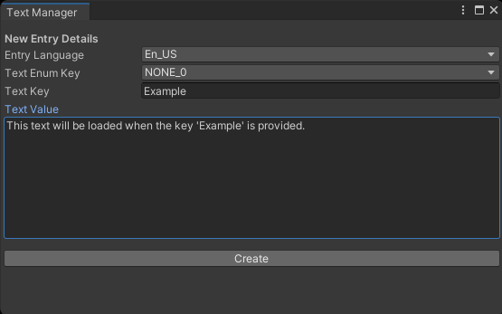
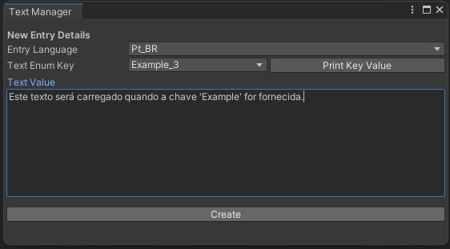
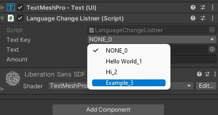

<h2>How to install?</h2>

Add as custom git package with package manager:

1. Open package manager
2. Click on the plus (➕) button
3. Choose "Add package from git URL"
4. Past the url: 
```
https://github.com/AndersonMarquess/AM_i18n.git?path=/Packages/com.andersonmarques.i18n
```

<h2>How to use?</h2>

<h3>Create Text Entry</h3>

1. Open the "Text Manager" window under the menu bar Tools>Text Manager
1. A new window will appear where you can set the KEY-VALUE data
1. Fill the "Text Key" field. This key will be used to reference the text content
1. On the "Text Value" field, enter the content that you want to save
1. Click the "Create" button to generate the data.


<h3>Translate Text Entry</h3>

1. After the data is generated you can add the translation to other languages. To do so, just change the "Entry Language" to the targeted language. (Add more language by manually change the Language.cs file)
1. Choose the key you want to translate and fill the "Text Value"
1. Click the "Create" button to generate the data.


<h3>Use Text Entry</h3>

1. Add the "Language Change Listener" component to your text mesh pro component.
1. Set what content will be filled by just choosing a key and thats it.



<h2>Usage example in code</h2>
<hr>

```cs
    // Load all text for the targeted language
    TextManager.Instance.SetGameLanguage("pt_BR");

    // Add language translation support in runtime
    LanguageChangeListener.AddListnerToText(_myTextMeshComponent, _targetKey);    
        
    // Key - The reference to text content.
    // Amount (optional) - The phrase index, use this to handle plural version.    
    // Json {
    //     "ABC" : [ "No Abc available", "One abc available", "{0} Abcs available" ]
    // }        
    TextManager.Instance.GetText(TextKey.ABC, 53); // "53 Abcs available"
    TextManager.Instance.GetText(TextKey.ABC); // "No Abc available"
```

<hr>
<h2>Currently supported operations</h2>

- Create new text entries in edit mode
- Runtime text bind
- Text content based on target language
- Plural support

<h2>Why was it created?</h2>
<p>I wanted to implement multi-language support in my game and learn to work with Json in the unity.</p>

<h2>License</h2>

- Yes, can be used commercially.
- No, you don't have to credit me, but that would be nice.
- MIT License.
